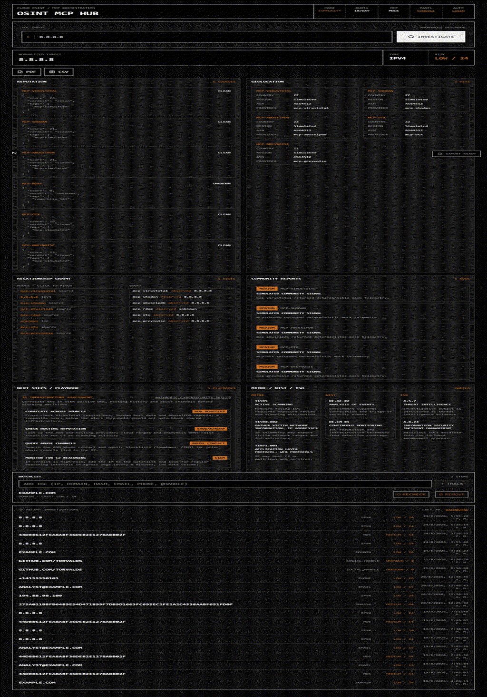

# HuntDeck - OSINT MCP Hub

[](LICENSE)
[](https://github.com/cruzamilcars/huntdeck/actions)
[](#)
[](#)

Cloud-native IOC (Indicator of Compromise) investigation hub. A SaaS-style MVP
for threat intelligence:

> **Paste an IOC — IP, domain, URL, hash, email, phone or social handle — and
> get one normalized tactical report in seconds:** risk score, reputation from
> **12 real threat-intel sources**, MITRE ATT&CK / NIST / ISO mappings,
> analyst playbooks, relationship graph and PDF/CSV export.


<p align="center">
  
</p>

**Why HuntDeck?** Analysts juggle VirusTotal, Shodan, AbuseIPDB, urlscan and
breach databases by hand, then translate findings into framework mappings and
next steps manually. HuntDeck orchestrates all of them through an MCP-style
adapter layer, normalizes the evidence into one contract, and tells you what
to do next — locally, with your own keys (BYOK), never sending data anywhere.

| | |
| --- | --- |
| 🔎 **12 real providers** | VirusTotal · Shodan · AbuseIPDB · RDAP · urlscan.io · HIBP · OpenCNAM · AlienVault OTX · GreyNoise · URLhaus (abuse.ch) · MISP (your instance) · Social Presence |
| 🧭 **Analyst playbooks** | Next-step guidance per IOC type distilled from the open-source Anthropic Cybersecurity Skills library |
| 🗺️ **Framework mappings** | MITRE ATT&CK techniques + tiered NIST CSF 2.0 and ISO 27001 controls by severity |
| 👁️ **Provider transparency** | Dashboard panel shows exactly which sources are live vs mocked and which API key unlocks each |
| ⏱️ **Watchlist auto-recheck** | Tracked IOCs refresh themselves (TTL-based, quota-bounded) so verdicts never go stale |
| 📦 **Ops-ready** | SQLite persistence out of the box (Supabase optional), freemium quota, service API keys for SIEM/CI, rate limiting, security headers |

- **Next.js** (App Router, TypeScript, Tailwind) tactical frontend — terminal-style
  IOC search and rigid modular result panels.
- **FastAPI** async backend that parses IOCs (IPv4/IPv6, domain, URL, MD5/SHA-1/SHA-256,
  email, phone, social handle), orchestrates **MCP** provider clients and returns one normalized
  tactical JSON contract.
- Freemium quota (10 free investigations/day) with automatic BYOK fallback.

> **Use responsibly.** This tool is for authorized security operations only.
> See [SECURITY.md](SECURITY.md).

---

## Current status

**v0.1.0 MVP — working end to end.** Paste an IOC into the console and get a
normalized tactical report: risk score, reputation, geolocation, relationship
graph, community reports and MITRE/NIST/ISO mappings, with PDF/CSV export.

> **Provider status:** **all twelve providers are real adapters** — VirusTotal,
> AbuseIPDB, Shodan, Have I Been Pwned, OpenCNAM, AlienVault OTX, GreyNoise
> and URLhaus (abuse.ch) need their free `*_API_KEY` env vars; MISP needs your
> instance's `MISP_URL` + `MISP_API_KEY`; all of them default to mocks when
> unset; **urlscan.io, RDAP
> and Social Presence are always live without a key** (RDAP uses the bootstrap
> registry at rdap.org; urlscan.io serves its search API anonymously with a
> reduced quota — add `URLSCAN_API_KEY` to lift it; Social Presence checks
> GitHub/Reddit/Telegram for handle attribution). RDAP enriches every IP/domain
> investigation with registrar, dates, nameservers and contact country;
> urlscan is the evaluated alternative to Firecrawl for URL/DOMAIN
> web-harvesting; HIBP reports email breaches (score/verdict per data class);
> OpenCNAM attributes phone numbers to carriers; OTX adds open-source threat
> pulses to every IP/domain/URL/hash. **No mock providers remain in the
> investigation paths.** Run
> `python scripts/verify-integrations.py` from `apps/api` to probe every
> configured integration against its live API; `pytest -m integration` runs
> the same checks as contract tests.

> **Persistence & operations:** investigations, daily quota, **watchlist** and
> **service API keys** are stored durably — no external service required by
> default: a local SQLite store (`DATABASE_PATH`, default `data/huntdeck.db`)
> makes quota survive restarts; `GET /api/v1/investigations/history` and
> `GET /api/v1/investigations/stats` (dashboard metrics) read from it. When
> `SUPABASE_URL` + `SUPABASE_SERVICE_ROLE_KEY` are both set, the API switches to
> the **Supabase store** (PostgREST with the service-role key) and reserves
> quota atomically via the `reserve_daily_usage` RPC. Apply
> `supabase/migrations/001..009` against a Supabase project to activate it.
>
> **Service API keys** (SIEM/CI integration without Supabase) are managed via
> CLI and validated as `X-API-Key` or Bearer:
> `python -m app.cli apikey create --name ci-bot --org dev-org` (plaintext
> printed once; only the SHA-256 hash is stored).

## Preview

The screenshot above is the live console investigating a malware hash: mock
VirusTotal verdict, playbook steps with tools, MITRE/NIST/ISO mappings and the
watchlist — all in one screen.

---

## Quick start

The default repo state runs **without any external accounts**: the API ships with
_mock MCP providers_ that return deterministic telemetry, and auth is optional
(anonymous dev mode).

```bash
# 1. Backend
cd apps/api
pip install -e ".[dev]"        # or: python -m venv .venv && activate first
python -m uvicorn app.main:app --reload   # or: npm run dev:api from repo root

# 2. Frontend (repo root)
npm ci
npm run dev:web                   # http://localhost:3000
```

Open http://localhost:3000, paste an IOC (e.g. `8.8.8.8`,
`44d88612fea8a8f36de82e1278abb02f` — md5 of "troll", or
`example.com`), hit **Investigate**.

### Docker

```bash
docker compose -f infra/docker/docker-compose.yml up --build
# web  -> http://localhost:3000
# api  -> http://localhost:8000/health
```

### Verify it works

```bash
curl http://localhost:8000/health                                  # {"status":"ok"}
curl -X POST http://localhost:8000/api/v1/investigations \
  -H "Content-Type: application/json" -d '{"ioc":"8.8.8.8"}'
```

---

## Configuration

Copy `.env.example` → split the variables into the files each app reads:
`apps/api/.env` (read by the API at runtime) and `apps/web/.env.local`
(`NEXT_PUBLIC_*` are inlined at web build time).

| Variable | Purpose |
| --- | --- |
| `NEXT_PUBLIC_SUPABASE_URL` / `NEXT_PUBLIC_SUPABASE_ANON_KEY` | Frontend Supabase client (auth). Optional for local dev. |
| `SUPABASE_URL` / `SUPABASE_SERVICE_ROLE_KEY` | Server-side Supabase access. |
| `SUPABASE_JWT_SECRET` | When set, the API validates bearer JWTs and rejects anonymous requests. |
| `NEXT_PUBLIC_API_BASE_URL` | Where the frontend calls the API (default `http://localhost:8000`). |
| `API_CORS_ORIGINS` | Allowed CORS origins, comma-separated. |
| `DAILY_FREE_QUOTA` | Free investigations per user/org/day (default `10`). |
| `RATE_LIMIT_PER_MINUTE` | API requests per IP per minute (default `60`). |
| `VIRUSTOTAL_API_KEY` | Optional. Real VirusTotal adapter (hash/IP/domain/URL). Falls back to mock when unset. |
| `ABUSEIPDB_API_KEY` | Optional. Real AbuseIPDB adapter (IPv4). Falls back to mock when unset. |
| `SHODAN_API_KEY` | Optional. Real Shodan adapter (IP host data + DNS). Falls back to mock when unset. |
| `URLSCAN_API_KEY` | Optional. Real urlscan.io adapter (URL/domain reputation); works anonymously without it (lower rate limit). |
| `HIBP_API_KEY` | Optional. Real Have I Been Pwned adapter (email breaches; score/verdict per data class). Falls back to mock when unset. |
| `OPENCNAM_API_KEY` | Optional. Real OpenCNAM adapter (phone CNAM/carrier). Falls back to mock when unset. |
| `OTX_API_KEY` | Optional. Real AlienVault OTX adapter (threat pulses for IP/domain/URL/hash). Falls back to mock when unset. |
| `GREYNOISE_API_KEY` | Optional. Real GreyNoise Community adapter (IPv4 scanner classification: benign RIOT services vs malicious internet noise). Falls back to mock when unset. |
| `MISP_URL` / `MISP_API_KEY` / `MISP_VERIFY_SSL` | Optional. Your MISP instance for org-internal indicator lookups (all IP/domain/URL/hash/email routes). Falls back to mock when unset. |
| `URLHAUS_API_KEY` | Optional. Real URLhaus adapter (URL/domain/hash malware listings from abuse.ch). Falls back to mock when unset. |
| `SUPABASE_URL` / `SUPABASE_SERVICE_ROLE_KEY` | Optional. Enables the Supabase store (PostgREST persistence + atomic quota RPC). Falls back to local SQLite when unset. |
| `DATABASE_PATH` | Local durable store path (default `data/huntdeck.db`). |

### Authentication (optional)

Run `supabase/migrations/001_initial_schema.sql` **and**
`supabase/migrations/002_quota_reserve_rpc.sql` against a Supabase project
(auth tables, RLS, Vault-backed BYOK RPCs and the atomic quota RPC are included).
Then set the env vars above and restart both apps. `http://localhost:3000/login` and `/register` become
active; the investigation calls are signed with the session JWT and scoped per
organization when `default_org_id` user metadata is present.

BYOK keys are stored through `create_user_api_key()` (encrypted in Vault); the
frontend never sees them.

---

## Project layout

```text
huntdeck/
  apps/
    web/                       # Next.js App Router frontend
      src/app/(auth)/          # login / register
      src/app/(dashboard)/investigate/   # main IOC console
      src/components/          # shell, search, results, export
      src/lib/api/             # typed API client + session
      src/lib/supabase/        # browser/server Supabase clients
      src/styles/              # brutalist dark theme
    api/                       # FastAPI backend
      app/
        api/v1/routes/         # HTTP routers (POST /investigations)
        agents/mcp/            # MCP client protocol + mock providers
        core/                  # config, security, rate limiting, headers
        domain/ioc/            # parser + IOC types
        domain/quota/          # freemium/BYOK quota service
        services/              # investigation orchestrator
      tests/                   # unit + integration (pytest)
  packages/shared/             # shared contracts (WIP)
  supabase/migrations/         # versioned SQL (schema + RLS + functions)
  docs/                        # architecture, execution plan, ADRs
  infra/docker/                # Dockerfiles + compose
```

### Tactical JSON contract

`POST /api/v1/investigations` returns a unified envelope (details in
[`docs/architecture.md`](docs/architecture.md)):

```json
{
  "ioc": { "raw": "8.8.8.8", "normalized": "8.8.8.8", "type": "ipv4" },
  "risk": { "score": 18, "severity": "low" },
  "modules": {
    "reputation": { "mcp-virustotal": { "score": 18, "verdict": "clean" } },
    "geolocation": { "mcp-shodan": { "country": "ZZ", "asn": "AS64512" } },
    "relationship_graph": { "nodes": [], "edges": [] },
    "community_reports": []
  },
  "mappings": {
    "mitre_attack": [{ "id": "T1595", "name": "Active Scanning" }],
    "nist": [],
    "iso": []
  },
  "sources": ["mcp-virustotal", "mcp-shodan", "mcp-abuseipdb"],
  "used_byok": false
}
```

---

## Project status

| Sprint | Scope | Status |
| --- | --- | --- |
| 1 | Monorepo, Supabase schema, RLS, Vault BYOK RPCs | Done |
| 2 | FastAPI + IOC parser + MCP mock orchestration + unified JSON | Done |
| 3 | Brutalist Next.js console (search, modules, export) | Done |
| 4 | Supabase Auth wiring, JWT checks, quota, BYOK fallback | Done (core) |
| 5 | Hardening: rate limit, security headers, strict validation, exports | Done |

See [`docs/execution-plan.md`](docs/execution-plan.md) for details. Real
provider adapters (VirusTotal, AbuseIPDB, Shodan, urlscan.io, RDAP, HIBP,
OpenCNAM, OTX, Social Presence) plug into the same `McpClient` protocol; see
the roadmap in the open issues and the provider status note above.

## Development

`npm run dev:web`, `npm run dev:api`, `npm run lint`, `npm test`, `pytest`.
See [CONTRIBUTING.md](CONTRIBUTING.md) for the full workflow and check list.

### CI status & alternatives

The GitHub Actions workflow is valid but **cannot start**: the account is
locked by an unresolved billing issue ("The job was not started because your
account is locked due to a billing issue" — every job fails in ~2s with zero
steps executed). Options:

1. **Fix it at the source** — resolve the lock in
   [Settings → Billing](https://github.com/settings/billing) or open a free
   billing support ticket at <https://support.github.com/request>; the
   existing workflow resumes untouched.
2. **Cirrus CI (free for public repos)** — this repo ships `.cirrus.yml`
   mirroring the same checks. Sign in at cirrus-ci.com, install its GitHub
   App on the repository, and pushes/PRs build there immediately.
3. **Local gate, no third party** — run the same checks before every push:
   ```bash
   git config core.hooksPath .githooks   # one-time activation
   ```
   `.githooks/pre-push` then runs API ruff + pytest and web lint + build.

### Provider status API

`GET /api/v1/system/providers` reports each MCP provider's mode (`real` /
`mock`), covered IOC types and which env var unlocks a mocked adapter — the
dashboard renders this as a "Provider status" panel so you always know
whether evidence comes from live sources or mocks.

## Security

See [SECURITY.md](SECURITY.md) — including how to report vulnerabilities and
operational notes (Vault usage, RLS, rate limits, TLS).

## License

[MIT](LICENSE) © HuntDeck contributors