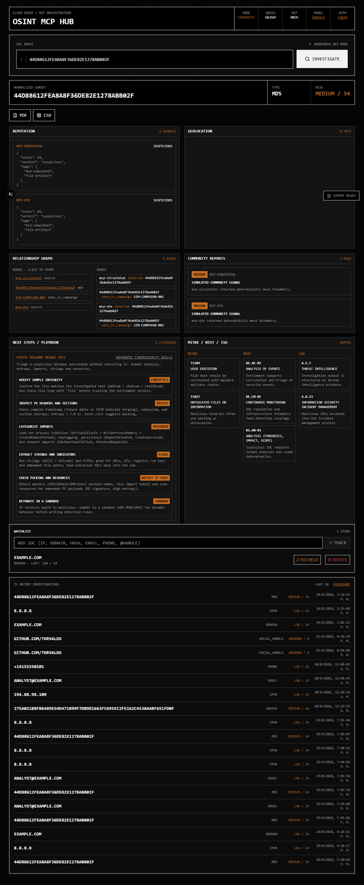

# HuntDeck - OSINT MCP Hub

[](LICENSE)
[](https://github.com/cruzamilcars/huntdeck/actions)
[](#)
[](#)

Cloud-native IOC (Indicator of Compromise) investigation hub. A SaaS-style MVP
for threat intelligence:

- **Next.js** (App Router, TypeScript, Tailwind) tactical frontend — terminal-style
  IOC search and rigid modular result panels (reputation, geolocation, relationship
  graph, community reports, MITRE/NIST/ISO mappings).
- **FastAPI** async backend that parses IOCs (IPv4/IPv6, domain, URL, MD5/SHA-1/SHA-256,
  email, phone), orchestrates **MCP** provider clients and returns one normalized
  tactical JSON contract.
- **Supabase** for auth (JWT), PostgreSQL persistence, row-level security and
  **BYOK** (Bring Your Own Key) secret storage via Supabase Vault.
- Freemium quota (10 free investigations/day) with automatic BYOK fallback.
- PDF/CSV export, rate limiting, strict security headers, redaction-friendly logs.

> **Use responsibly.** This tool is for authorized security operations only.
> See [SECURITY.md](SECURITY.md).

---

## Current status

**v0.1.0 MVP — working end to end.** Paste an IOC into the console and get a
normalized tactical report: risk score, reputation, geolocation, relationship
graph, community reports and MITRE/NIST/ISO mappings, with PDF/CSV export.

> **Provider status:** the MCP providers ship as mocks (`apps/api/app/agents/mcp/`)
> so the whole product loop is runnable without external API keys. The
> **VirusTotal adapter is real** — set `VIRUSTOTAL_API_KEY` to query live data
> (file hashes, IPs, domains, URLs); AbuseIPDB, Shodan and Firecrawl
> are next on the roadmap (see open issues).

## Preview



---

## Quick start

The default repo state runs **without any external accounts**: the API ships with
_mock MCP providers_ that return deterministic telemetry, and auth is optional
(anonymous dev mode).

```bash
# 1. Backend
cd apps/api
pip install -e ".[dev]"        # or: python -m venv .venv && activate first
python -m uvicorn app.main:app --reload   # or: npm run dev:api from repo root

# 2. Frontend (repo root)
npm ci
npm run dev:web                   # http://localhost:3000
```

Open http://localhost:3000, paste an IOC (e.g. `8.8.8.8`,
`44d88612fea8a8f36de82e1278abb02f` — md5 of "troll", or
`example.com`), hit **Investigate**.

### Docker

```bash
docker compose -f infra/docker/docker-compose.yml up --build
# web  -> http://localhost:3000
# api  -> http://localhost:8000/health
```

### Verify it works

```bash
curl http://localhost:8000/health                                  # {"status":"ok"}
curl -X POST http://localhost:8000/api/v1/investigations \
  -H "Content-Type: application/json" -d '{"ioc":"8.8.8.8"}'
```

---

## Configuration

Copy `.env.example` → split the variables into the files each app reads:
`apps/api/.env` (read by the API at runtime) and `apps/web/.env.local`
(`NEXT_PUBLIC_*` are inlined at web build time).

| Variable | Purpose |
| --- | --- |
| `NEXT_PUBLIC_SUPABASE_URL` / `NEXT_PUBLIC_SUPABASE_ANON_KEY` | Frontend Supabase client (auth). Optional for local dev. |
| `SUPABASE_URL` / `SUPABASE_SERVICE_ROLE_KEY` | Server-side Supabase access. |
| `SUPABASE_JWT_SECRET` | When set, the API validates bearer JWTs and rejects anonymous requests. |
| `NEXT_PUBLIC_API_BASE_URL` | Where the frontend calls the API (default `http://localhost:8000`). |
| `API_CORS_ORIGINS` | Allowed CORS origins, comma-separated. |
| `DAILY_FREE_QUOTA` | Free investigations per user/org/day (default `10`). |
| `RATE_LIMIT_PER_MINUTE` | API requests per IP per minute (default `60`). |
| `VIRUSTOTAL_API_KEY` | Optional. When set, the API queries real VirusTotal data (falls back to the mock adapter when unset). |

### Authentication (optional)

Run `supabase/migrations/001_initial_schema.sql` against a Supabase project
(auth tables, RLS, Vault-backed BYOK RPCs are included). Then set the env vars
above and restart both apps. `http://localhost:3000/login` and `/register` become
active; the investigation calls are signed with the session JWT and scoped per
organization when `default_org_id` user metadata is present.

BYOK keys are stored through `create_user_api_key()` (encrypted in Vault); the
frontend never sees them.

---

## Project layout

```text
osint-mcp-hub/
  apps/
    web/                       # Next.js App Router frontend
      src/app/(auth)/          # login / register
      src/app/(dashboard)/investigate/   # main IOC console
      src/components/          # shell, search, results, export
      src/lib/api/             # typed API client + session
      src/lib/supabase/        # browser/server Supabase clients
      src/styles/              # brutalist dark theme
    api/                       # FastAPI backend
      app/
        api/v1/routes/         # HTTP routers (POST /investigations)
        agents/mcp/            # MCP client protocol + mock providers
        core/                  # config, security, rate limiting, headers
        domain/ioc/            # parser + IOC types
        domain/quota/          # freemium/BYOK quota service
        services/              # investigation orchestrator
      tests/                   # unit + integration (pytest)
  packages/shared/             # shared contracts (WIP)
  supabase/migrations/         # versioned SQL (schema + RLS + functions)
  docs/                        # architecture, execution plan, ADRs
  infra/docker/                # Dockerfiles + compose
```

### Tactical JSON contract

`POST /api/v1/investigations` returns a unified envelope (details in
[`docs/architecture.md`](docs/architecture.md)):

```json
{
  "ioc": { "raw": "8.8.8.8", "normalized": "8.8.8.8", "type": "ipv4" },
  "risk": { "score": 18, "severity": "low" },
  "modules": {
    "reputation": { "mcp-virustotal": { "score": 18, "verdict": "clean" } },
    "geolocation": { "mcp-shodan": { "country": "ZZ", "asn": "AS64512" } },
    "relationship_graph": { "nodes": [], "edges": [] },
    "community_reports": []
  },
  "mappings": {
    "mitre_attack": [{ "id": "T1595", "name": "Active Scanning" }],
    "nist": [],
    "iso": []
  },
  "sources": ["mcp-virustotal", "mcp-shodan", "mcp-abuseipdb"],
  "used_byok": false
}
```

---

## Project status

| Sprint | Scope | Status |
| --- | --- | --- |
| 1 | Monorepo, Supabase schema, RLS, Vault BYOK RPCs | Done |
| 2 | FastAPI + IOC parser + MCP mock orchestration + unified JSON | Done |
| 3 | Brutalist Next.js console (search, modules, export) | Done |
| 4 | Supabase Auth wiring, JWT checks, quota, BYOK fallback | Done (core) |
| 5 | Hardening: rate limit, security headers, strict validation, exports | Done |

See [`docs/execution-plan.md`](docs/execution-plan.md) for details. The MCP
clients ship as mocks (`apps/api/app/agents/mcp/`); real provider adapters plug
into the same `McpClient` protocol.

## Development

`npm run dev:web`, `npm run dev:api`, `npm run lint`, `npm test`, `pytest`.
See [CONTRIBUTING.md](CONTRIBUTING.md) for the full workflow and check list.

## Security

See [SECURITY.md](SECURITY.md) — including how to report vulnerabilities and
operational notes (Vault usage, RLS, rate limits, TLS).

## License

[MIT](LICENSE) © OSINT MCP Hub contributors