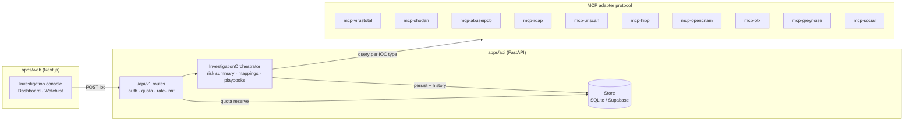

# Arquitectura de carpetas

## Flujo de investigacion



Twelve adapters reales detras del mismo protocolo; los key-gated caen a mocks
deterministas hasta configurar su `*_API_KEY`. `GET /api/v1/system/providers`
reporta el estado real/mock de cada uno.

```text
huntdeck/
  apps/
    web/                         # Next.js App Router
      src/
        app/
          (auth)/login/           # Rutas de autenticacion
          (dashboard)/investigate/ # Experiencia principal IOC
        components/
          layout/                 # Shell, nav, paneles base
          search/                 # Barra terminal de IOC
          results/                # Modulos tacticos de resultados
          export/                 # PDF/CSV
        lib/
          api/                    # Cliente FastAPI
          supabase/               # Cliente Supabase browser/server
        styles/                   # Tailwind/theme brutalista
    api/                          # FastAPI
      app/
        api/v1/routes/            # Routers HTTP (investigations, watchlist, system)
        agents/mcp/               # Cliente MCP y adapters reales por proveedor
        core/                     # Config, seguridad, rate limiting, headers
        domain/
          ioc/                    # Parseo, tipos y normalizacion IOC
          quota/                  # Freemium/BYOK
          reports/                # Export/report contracts
        infrastructure/           # Stores: SQLite local / Supabase PostgREST
        schemas/                  # Pydantic DTOs
        services/                 # Orquestacion, playbooks, providers registry
      scripts/
        verify-integrations.py    # Probe en vivo de las 12 integraciones
      tests/
        unit/
        integration/
  packages/
    shared/src/                   # Tipos/contratos compartidos cuando aplique
  supabase/
    migrations/                   # SQL versionado
    policies/                     # Politicas adicionales si se separan
    seed/                         # Datos no sensibles de desarrollo
  docs/
    adr/                          # Decisiones arquitectonicas
  infra/
    docker/                       # Compose/Dockerfiles futuros
    deploy/                       # IaC/deploy futuro
```

## Decisiones iniciales

1. El backend es el unico responsable de la orquestacion MCP.
2. El frontend nunca recibe claves API BYOK ni secretos de proveedores.
3. Supabase Auth mantiene identidades; `public.profiles` agrega datos de producto.
4. RBAC se modela por organizacion para soportar SOCs y equipos Red/Blue Team.
5. El historial de investigaciones se guarda por organizacion, no solo por usuario.
6. Las claves BYOK se guardan en Vault y `public.user_api_keys` solo conserva referencias.
7. El limite Community se controla por `daily_usage`, con default de 10 consultas gratis/dia por organizacion/usuario.

## Contrato tactico de resultados

El backend devuelve un JSON consolidado con estas secciones:

```json
{
  "ioc": {
    "raw": "string",
    "normalized": "string",
    "type": "ipv4 | ipv6 | domain | url | md5 | sha1 | sha256 | email | phone | social_handle"
  },
  "risk": { "score": 0, "severity": "unknown | low | medium | high | critical" },
  "modules": {
    "reputation": {},
    "geolocation": {},
    "relationship_graph": {},
    "community_reports": []
  },
  "mappings": { "mitre_attack": [], "nist": [], "iso": [] },
  "playbooks": [
    { "title": "...", "source": "...", "reference": "...", "steps": [] }
  ],
  "sources": [],
  "used_byok": false,
  "quota": { "reason": "platform_quota" }
}
```

> El contrato canonico vive en `packages/shared/src/contract.ts`
> (`@huntdeck/shared`); el frontend lo re-exporta desde
> `apps/web/src/lib/api/types.ts`. Si el backend agrega un campo,
> actualizar ambos lados en el mismo commit.

## Proveedores MCP (12 adapters reales)

| Provider | IOC cubiertos | Key |
| --- | --- | --- |
| `mcp-virustotal` | ipv4, ipv6, domain, url, hashes | `VIRUSTOTAL_API_KEY` |
| `mcp-shodan` | ipv4, ipv6, domain | `SHODAN_API_KEY` |
| `mcp-abuseipdb` | ipv4, ipv6 | `ABUSEIPDB_API_KEY` |
| `mcp-rdap` | ipv4, ipv6, domain | siempre activo (bootstrap rdap.org) |
| `mcp-urlscan` | domain, url | opcional (`URLSCAN_API_KEY` sube la cuota) |
| `mcp-hibp` | email | `HIBP_API_KEY` |
| `mcp-opencnam` | phone | `OPENCNAM_API_KEY` |
| `mcp-otx` | ipv4, ipv6, domain, url, hashes | `OTX_API_KEY` |
| `mcp-greynoise` | ipv4 | `GREYNOISE_API_KEY` |
| `mcp-misp` | ipv4, ipv6, domain, url, hashes, email | tu instancia (`MISP_URL` + `MISP_API_KEY`) |
| `mcp-urlhaus` | domain, url, hashes | `URLHAUS_API_KEY` |
| `mcp-social` | social_handle | siempre activo (GitHub/Reddit/Telegram) |

Sin key configurada, los adapters key-gated caen a mocks deterministas;
`GET /api/v1/system/providers` reporta el estado real/mock de cada uno y el
dashboard lo renderiza en el panel "Provider status".

## Watchlist con auto-recheck

`GET /api/v1/watchlist` refresca perezosamente los items obsoletos: los nunca
chequeados o con `last_checked_at` anterior a `recheck_ttl_hours` (default 24)
se re-investigan, del mas viejo al mas nuevo, con presupuesto de
`recheck_max` (default 3 por llamada). `recheck_max=0` lista sin refrescar.

## Rate limiting

Ventana deslizante por identidad: trafico anonimo por IP
(`RATE_LIMIT_PER_MINUTE`, default 60); credenciales de servicio `X-API-Key`
por huella de la clave (`SERVICE_RATE_LIMIT_PER_MINUTE`, default 300), para
que SIEM/CI no compita con navegadores. `/health` queda exento.

## Deuda conocida: cache y rate limiting son por proceso

El `InvestigationOrchestrator` cachea respuestas 5 minutos en un dict en
memoria (`_cache`, max 256 entradas, sin cachear BYOK ni rechecks con
`quota` explicita) y el rate limiting tambien vive en el proceso. Con un
solo worker de uvicorn (el default del MVP) es correcto: la cuota se aplica
de forma durable en SQLite/Supabase via RPC atomico, asi que el limite
freemium nunca se puede evadir — como maximo un IOC se investiga dos veces
en workers distintos.

Al escalar a `--workers > 1` o varias replicas, migrar a un cache
compartido (Redis: `SETEX ioc:<normalized> 300 <json>` + rate limit con
`INCR` + ventana deslizante) antes de subir replicas.

